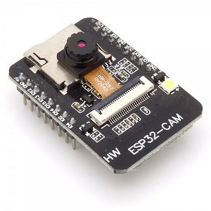

# Camera Webserver ESP32-CAM AI-THINKER Board with LED control Version 2

- stable IP-WebCam for linux-motion (OV2640 only)
- ESP-IDF V4.4 project, C code.



## Overview

This is a new software for the famous little **esp32-cam** modul optimized for multible webcams with **linux-motion**.
- small network load due to reduced framerate **8fps at 640*480.(typ. 1Mbits/sec per Cam)**
- stable Wifi reconnect
- **Wifi ssid/passwd** config via serial interface to **store in NVS** (eeprom) (max 10)
- Boot-indication by small red Debug-LED. Is on until succesful connect to Wifi. (visual feedback of connect)

A custom tcpserver interacts directly with lwIP via BSD Socket API. No facedetect!.

## ++UPDATE++
- Updated software to IDF version 4.4
- bugfix: removed wifi retry counter for stable reconnect
- webpage: status: added **UpTime(hrs)**(to check for last reset/connection loss)  and **RSSI signal strength**(to monitor wifi quality)
- Compile: **idf.py build**, then **idf.py flash monitor**.    Also make and make flash monitor could be used.

## Web-Interface
has been updated.
- Status line: at top of page shows: NetworkFPS(Netw-Throuput), CameraFPS(OV2640FPS), I2sFPS(driver) QUEerrors(driver), JPGerros(I2S), UpTime, RSSI.  
  via GET Button
- nightmode: long exposure times, auto-framerate 3 to 25 fps depending on light. AEC and AGC must be ON!!!
- streamspeed: change between slow(default)(better exposure in dark) and full(full speed)
- flashlight: enable highpower LED on still capture
- streamlight: enable highpower LED during streaming
- ESP32RESET: down below in ClockSettings. This will Reset the esp32 processor, software reset.


## IP interfaces via http://
- camIP = loads the Webpage as above for interactive camera control
- camIP:81/stream = streaming interface (optional streamlight)
- camIP/capture = capture/save still image (optional flashlight)
- camIP/download = download image directly from camera.(optional flashlight) 

The camera may be configured without webpage if appropriate control/json strings are send.  
Settings are always feedback via serial interface if connected.


## Hardware
This nice little ESP32-CAM board sold everywhere might give you some headaches.  
Brownout-resets, wifi-disconnects, boot errors, .... camera has horizontal stripes...  

The spec says, supply it with 5V on the 5V-pin.  
There is a voltageregulator picking up the 5V and convert it to 3.3V  
needed by the board to operate properly. 
 
It seems that this regulator is working just "on the edge" with 5V.  
Raising the powersupply voltage to **5.4V** (upto 6 or so volts) gives a much more relyable operation, in my experience!.  
(my horizontal stripes were gone;)  
Ie. some moduls work with 5V, some dont, needing 5.4V+  

The **USB-A connector** into the USB-charger also causes problems.
If it gets dirty there is a remarkable resistance which causes voltage-drops on current-spikes!

The HighPower LED gets very hot!!

## Arduino
I know many folks are using **Arduino IDE**.  

Including an external esp32 C project in Arduino you need the esp32-cam board files.  
(which also includes the ESP-IDF arduino version, plus the camera driver maybe?)  
(preferences->additional Boardmanagers Url:)  
https://raw.githubusercontent.com/espressif/arduino-esp32/gh-pages/package_esp32_index.json  
Then Tools->boardmanager:  
select "AI-Thinker esp32-cam" as board.  

I tried it, using a sketch like this:
```
extern "C"{
void app_main_camera(void); // main camera function renamed to avoid conflict with arduino app_main()
}

void setup() {
  // put your setup code here, to run once:
app_main_camera(); // this shall never return! cameras main function.
}

void loop() {
  // put your main code here, to run repeatedly: there is nothing todo repeatedly.
}
``` 
 Added sourcefiles as needed to the sketch(no subdirectorys)...however, didnt compile through (but quite a bit!).  
 Maybe you have more luck ?!  
 
## Binarys
For those who do not want to compile anything, i added the binarys to this repo.  
You can flash it with esptool.py. There is also a Windows-exe version. (see "binarys" docu on flashing)  
You can add Wifi credentials via serial afterwards!!

## Linux Motion
I have several cameras connected to Linux-Motion, running very stable.  
Due to the low Framerate networkload is not a problem.  
About 1Mbits/s per cam.  
I added some sample configfiles for LinuxMotion in docu.  

## Wifi credentials
**Editing Wifi credentials via serial Port:**

You obviouly need to be connected with a terminal (putty?) to the serial port at 8N1, 115200.  
After reset the bootup will stop for 2 seconds at message "+++LoginEdit+++".  
If you hit the SPACE key at this point you will enter an interactive dialog to enter/edit Wifi credentials which are saved in NVS (eeprom).  
There are 10 entrys you can edit.  

Edit options are:  
- list = list all 10 entrys (empty ones are just blank)
- edit<num> = enter new ssid/passwd
- delete<num> = delete entry
- save = save change to NVS (dont forget this)
- Quit = exit the dialog and continue bootup with saved credentials.


Have fun ;) xenpac